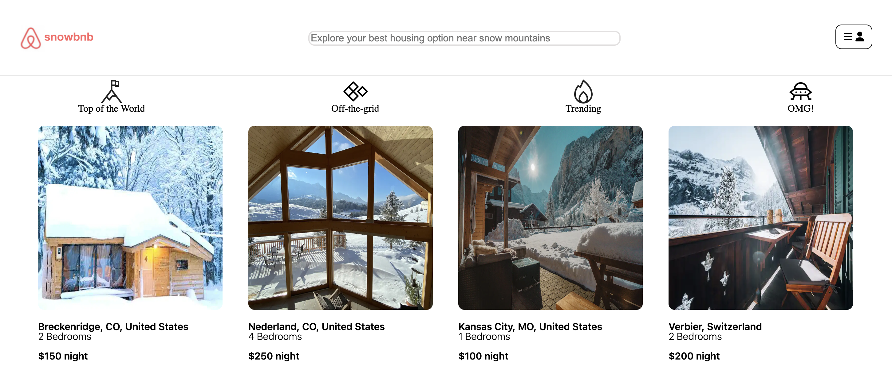

# [Snowbnb](https://snowbnb.onrender.com/)
### This is a full stack web application that is a clone of Airbnb. It intends to help users finding the best listings for ski trips. 
***

## Technologies Used

- Ruby on Rails
- Javascript
- React/Redux
- PostgresSQL
- AWS S3

---

## Features

- Users can look at all the listings in the home page
- Users can also check out each listing 

Getting the calendar to show date range requires the react-date-range library, which gives a pretty cool calendar UI.

```
import 'react-date-range/dist/styles.css'; // main style file
import 'react-date-range/dist/theme/default.css'; // theme css file
import './ReservationForm.css'

<DateRangePicker
  ranges={[selectionRange]}
  onChange={handleSelect}
  months={2}
  direction="horizontal"
  />
```
---
## Planned Future Features
- Search - users can search for listings in the locations they want
- Reviews - users can write, update, delete reviews


